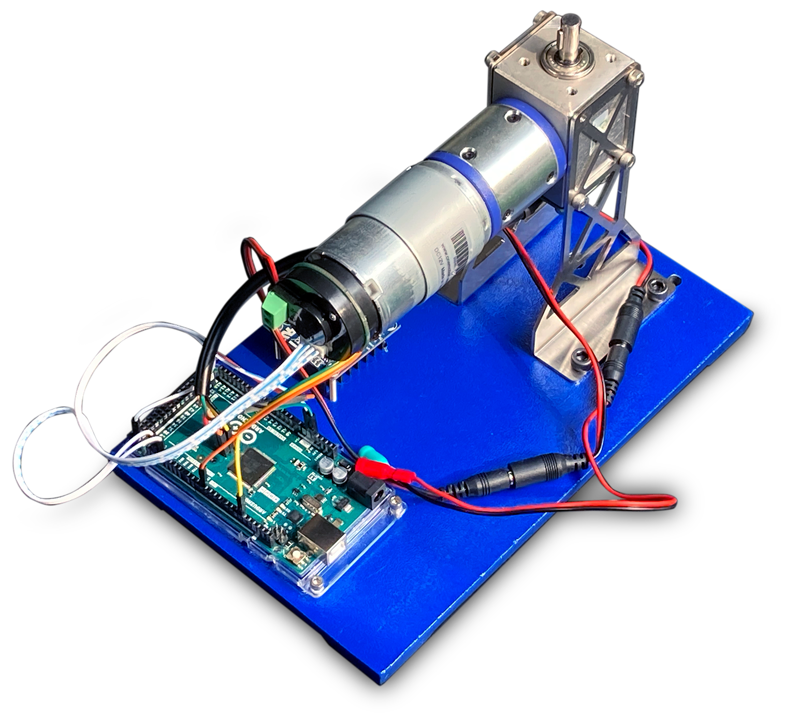
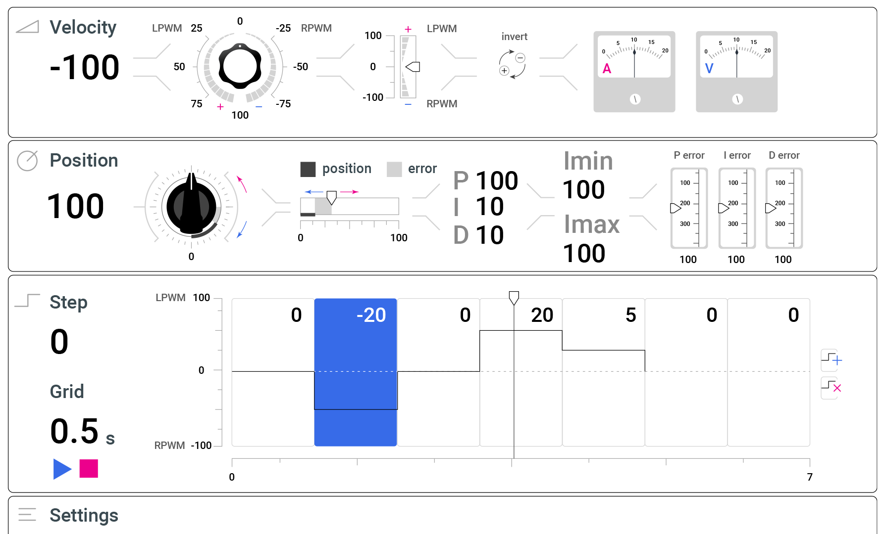

# PID Tuner

This application can help you characterize a DC motor and tune a PID controller for it.





## Install Packages

```
sudo apt-get install ros-${ROS_DISTRO}-rosserial-arduino
sudo apt-get install ros-${ROS_DISTRO}-rosserial

cd ~/catkin_ws/src

rosdep install -y --from-paths . --ignore-src --rosdistro noetic
```

## Build

Build the workspace:

```
cd ~/catkin_ws
catkin_make
```

Build the Arduino serial node:

```
rosrun rosserial_arduino make_libraries.py ~/Arduino/libraries
```

> The Arduino libraries are usually in `~/Arduino/libraries`. If you installed Arduino IDE as a *snap*, you could also try looking in `~/snap/arduino`.

Build [serial.ino](./serial/serial.ino) ROS Serial node and upload to Arduino.

## Run

Launch the Arduino Serial node:

```
roslaunch pidtuner pidtuner.launch
```

Launch the React application:

```
cd ui
npm i
npm run dev
```

## Configuration

```
rostopic pub /configuration pidtuner/Configuration \
"{
    LPWMpin: 3, \
    RPWMpin: 11, \
    ADCpin: 0, \
    csPin: 53, \
    Apin: 18, \
    Bpin: 19, \
    Kp: 200, \
    Ki: 10, \
    Kd: 10, \
    iMin: 0, \
    iMax: 100 \
}" -1
```

## Velocity

```
rostopic pub /velocity pidtuner/VelocityCommand "{ command: 0.5 }" -1
```

## Position

```
rostopic pub /position pidtuner/PositionCommand "{ goal: 0.0, tolerance: 0.0 }" -1
```

## Step

```
rostopic pub /step pidtuner/StepCommand "{
    loop: false, \
    steps: [ \
        { command: 1.5, duration: 2.0 }, \
        { command: 0.0, duration: 1.0 }, \
        { command: 0.3, duration: 1.0 }, \
        { command: 1.0, duration: 2.0 }, \
        { command: 0.0, duration: 1.0 },
    ] \
}" -1
```

## Emergency Stop

```
rostopic pub /estop pidtuner/EmergencyStop "{ stop: true }" -1
```